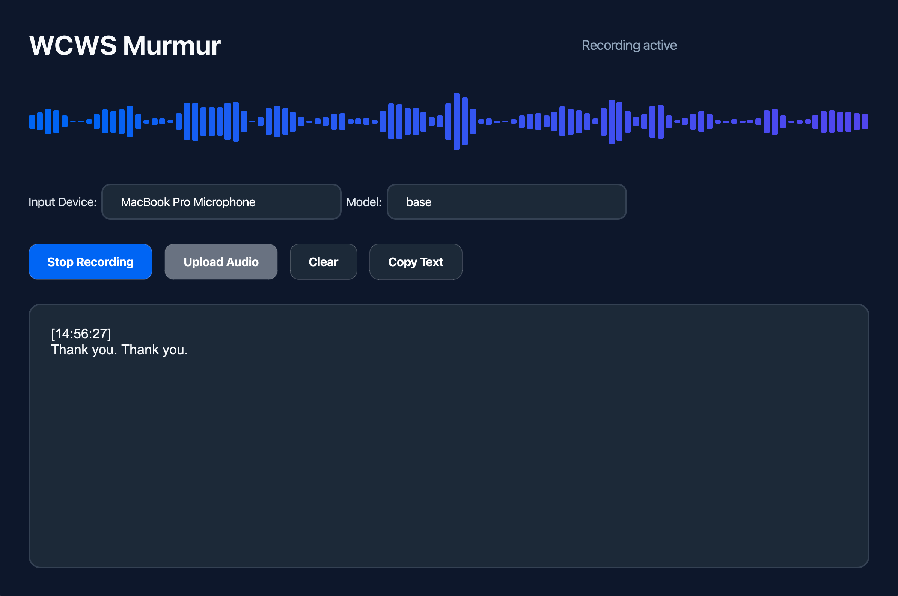

# WCWS-Whisper: Real-Time Speech Transcription Application



A modern, desktop-based real-time speech transcription application developed by Sohaib Khan. This application leverages OpenAI's Whisper model to provide accurate speech-to-text conversion with a beautiful, user-friendly interface.

## Features

- 🎤 Real-time speech transcription
- 📁 Audio file transcription support
- 🎨 Modern and intuitive UI built with PyQt6
- 📊 Live audio waveform visualization
- 🔄 Multiple Whisper model options (from tiny to large)
- 📋 Copy-to-clipboard functionality
- 🎵 Audio device selection support
- 🌊 Beautiful waveform visualization during recording

## Requirements

- Python 3.8+
- FFmpeg (included in the package)
- GPU recommended for better performance with larger models

## Installation

1. Clone the repository:
```bash
git clone https://github.com/sohaibkhan/WCWS-Whisper.git
cd WCWS-Whisper
```

2. Create a virtual environment and activate it:
```bash
python -m venv venv
source venv/bin/activate  # On Windows use: venv\Scripts\activate
```

3. Install the required dependencies:
```bash
pip install -r requirements.txt
```

## Usage

1. Run the application:
```bash
python main.py
```

2. Select your preferred Whisper model size from the dropdown menu
3. Choose your audio input device
4. Click the "Start Recording" button to begin transcription
5. For file transcription, use the "Open File" button to select an audio file

## Key Dependencies

- PyQt6 - Modern GUI framework
- OpenAI Whisper - Speech recognition model
- torch - Deep learning framework
- sounddevice - Audio recording
- numpy - Numerical computations
- pydub - Audio file handling

## Building from Source

To build the application as a standalone executable:

```bash
python setup.py py2app
```

The built application will be available in the `dist` directory.

## Contributing

Contributions are welcome! Please feel free to submit a Pull Request.

## License

This project is licensed under the MIT License - see the LICENSE file for details.

## Acknowledgments

- OpenAI for the Whisper model
- PyQt team for the excellent GUI framework
- All contributors and users of WCWS-Whisper

## Contact

Sohaib Khan
- GitHub: [@sohaibkhan](https://github.com/sohaibkhan)

---
Last updated: December 27, 2024
